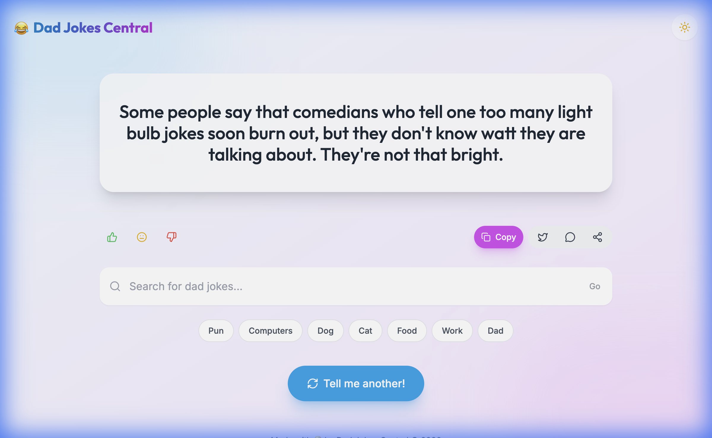

# Dad Jokes Central 😂

Welcome to the modernized **Dad Jokes Central**, a fun and interactive web application for all your cheesy humor needs. Now featuring a sleek glassmorphism UI, dark mode, and social sharing!



## Features ✨

-   **Random Joke Generator**: Instantly fetch a fresh dad joke with one click.
-   **Curated Categories**: Browse jokes by topic—**Computers**, **Dogs**, **Cats**, **Food**, **Work**, and **Dad**.
-   **Smart Search**: Find specific jokes by keyword.
-   **Interactive Actions**:
    -   **Copy**: One-click copy with celebratory confetti 🎉
    -   **Share**: Direct sharing to **Twitter** and **WhatsApp**.
    -   **React**: Upvote/Downvote/Meh buttons.
-   **Modern UX**:
    -   **Dark Mode**: Fully supported dark theme for late-night laughs 🌙
    -   **Animations**: Smooth entry transitions and loading skeletons.
    -   **Responsive**: Looks great on mobile, tablet, and desktop.

## Tech Stack 🛠️

-   **React** (v18)
-   **TypeScript**
-   **Vite** - Fast build tool
-   **Tailwind CSS** - Styling & Design System
-   **Framer Motion** - Animations
-   **Lucide React** - Icons
-   **Canvas Confetti** - Fun visual effects

## Getting Started 🚀

To run the app locally:

1.  **Clone the repository**:
    ```bash
    git clone https://github.com/sagarneeli/dad-jokes-central.git
    cd dad-jokes-central
    ```

2.  **Install dependencies**:
    ```bash
    npm install
    ```

3.  **Start the development server**:
    ```bash
    npm run dev
    ```

4.  **Open your browser**:
    Navigate to `http://localhost:5173`

## Project Structure 📂

-   `src/components`: UI components (`JokeDisplay`, `Controls`, `Actions`)
-   `src/components/ui`: Reusable design system (`Button`, `Card`)
-   `src/hooks`: Custom hooks (`useJoke`, `useDarkMode`)
-   `src/api.ts`: API integration logic

## License 📄

This project is licensed under the MIT License.

## Acknowledgements 🙏

-   Jokes provided by the [icanhazdadjoke](https://icanhazdadjoke.com/) API.
-   Inspired by the need for more groans in the world.
